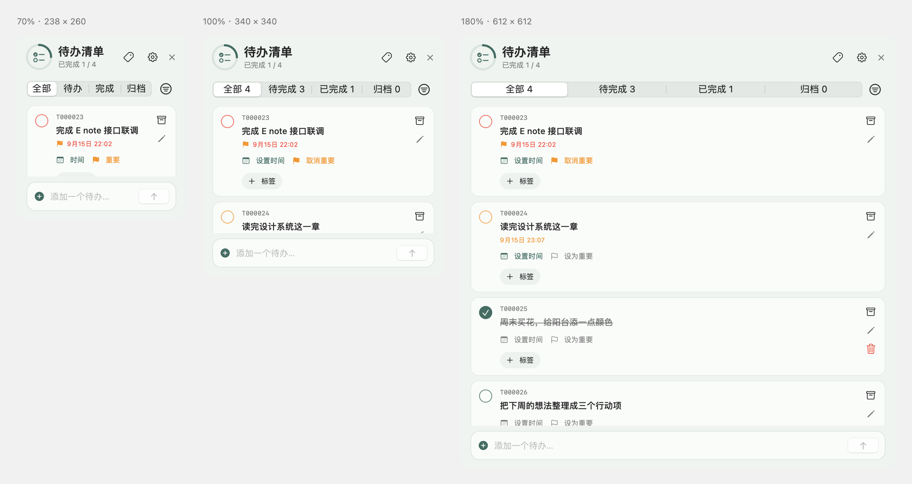
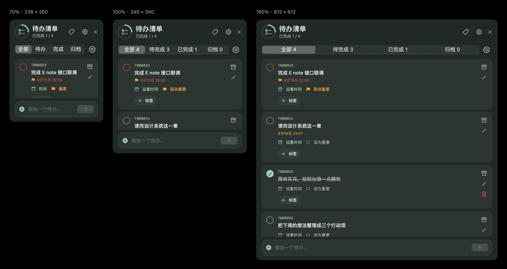
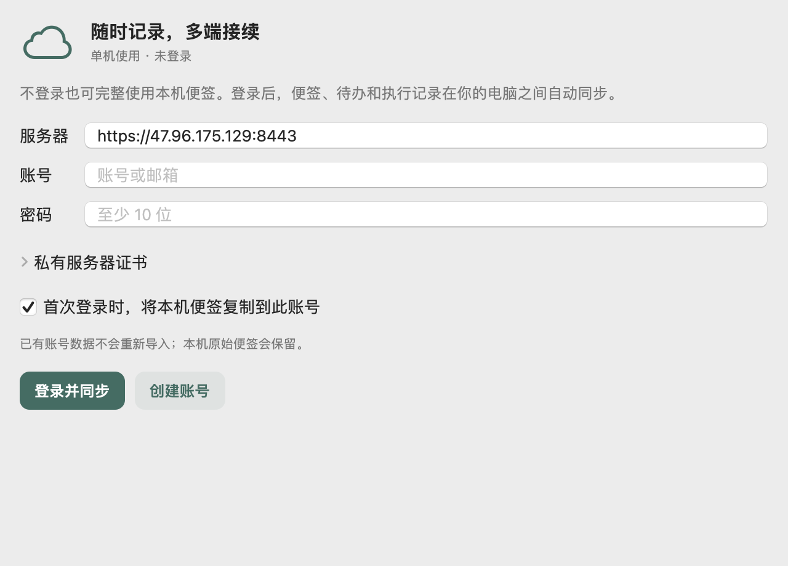

<div align="center">
  
  <h1>E note</h1>
  <p><strong>想法随手记，待办有着落。</strong></p>
  <p>安静停在 macOS 屏幕边缘的便签与任务清单。</p>
  <p>macOS 13+ · 本机优先 · 多端同步 · 飞书 × AI · API & Skill</p>
  <p><a href="#快速开始">快速开始</a> · <a href="#账号与多端同步">云端同步</a> · <a href="#飞书远程执行">飞书 × AI</a> · <a href="#独立-待办清单">待办清单</a> · <a href="#api-对接">API 对接</a> · <a href="#skill-对接">Skill 对接</a></p>
</div>

---

**作者：韦冬** · [2220285589@qq.com](mailto:2220285589@qq.com)

E note 把随手记录和行动清单放在屏幕边缘。普通便签承载想法、资料和临时记录；独立的 **待办清单 固定占用第一张便签的位置**，负责分类任务、稳定编号和到期提醒。程序或 AI 可以通过本地 API 创建便签、添加任务，并按编号修改内容。

**不登录，安静做一张本机便签；登录后，把任务和记录带到每台电脑。** 通过飞书与本机 AI 讨论需求，确认实施方案后执行，过程与结果自动写入关联便签，验收后完成待办。桌面不收集遥测。

## 界面预览

| 模块 | 独立配色 | 标签 / 纸面 |
| --- | --- | --- |
| 待办清单 | 松柏绿 | 深松柏绿标签，浅鼠尾草纸面；深色模式适配墨绿底色 |
| 普通便签 · 默认一 | 杏砂 | 暖杏砂标签，奶油纸面 |
| 普通便签 · 默认二 | 雾紫 | 柔雾紫标签，浅紫白纸面 |

新建普通便签交替使用这两种默认色，已有深蓝 / 天蓝便签会在加载时更新。其他手选颜色继续保留。

[查看配色示意](docs/images/palette.png)

待办清单 使用独立的松柏绿主题，普通便签默认交替使用杏砂与雾紫。圆角任务卡片、完成进度环、分类标签、重要标记与到期状态，支持深浅色外观。下图由应用的真实 SwiftUI / AppKit 视图渲染，展示三种窗口尺寸；任务内容为演示数据。



<details>
<summary><strong>查看深色界面</strong></summary>



</details>

## 能做什么

| 随手记录 | 专注行动 | 程序与 AI |
| --- | --- | --- |
| 屏幕边缘唤醒、叠层标签 | 独立 待办清单，始终第一位 | 本机 HTTP API |
| 自动保存、八色便签 | 固定编号、分类、优先级 | 批量添加任务 |
| 快速捕捉、正文查找 | 勾选完成、状态筛选 | 按编号修改内容和到期时间 |
| 归档、删除撤销、导入导出 | 临近到期探出标签 | 配套 `e-note` skill 与 Python 客户端 |

## 快速开始

### 直接下载安装（无需编程环境）

**[下载 macOS 安装包](https://github.com/itxd/E-note/releases/latest/download/E-note-macOS-universal.dmg)** · [所有版本](https://github.com/itxd/E-note/releases) · [完整安装说明](docs/INSTALL.txt)

适用于 **macOS 13+，Intel 和 Apple 芯片**。打开 DMG，将 **E note** 拖入 **Applications（应用程序）**，再从应用程序文件夹启动。把鼠标移到屏幕边缘的小条即可使用；应用不显示 Dock 图标，无需登录即可管理本机便签和待办。

当前下载版采用临时签名，尚未经过 Apple Developer ID 签名和公证。首次打开若提示无法验证开发者，确认来源可信后，在「系统设置 → 隐私与安全性」中选择「仍要打开」。详见 [Apple 官方说明](https://support.apple.com/zh-cn/102445)。

### 从源码构建

需要 macOS 13 或更高版本，以及 Xcode Command Line Tools。Python 客户端、Skill 安装脚本和测试需要 Python 3，客户端只使用标准库。

在项目目录执行：

```bash
./build.sh run
```

构建产物为 `build/E note.app`。已有旧版运行时，先退出旧版再打开新构建的应用。

1. 将指针移到屏幕边缘的小条上，展开便签标签。
2. 第一张是 **待办清单**；点击后可在底部输入任务，按回车添加。
3. 在「全部」「待完成」卡片中直接点击「设置时间」「设为重要」；点击右侧铅笔修改标题。已完成或已归档的任务显示删除按钮。
4. 使用 `⌥⌘N` 新建普通便签，使用 `⇧⌘Space` 快速捕捉。
5. 右键边缘小条选择 **设置…**，调整常驻开关、提醒时间、外观与 API。

其他构建方式：

```bash
./build.sh        # release：编译、组装 .app、ad-hoc 签名与验证
./build.sh debug  # 调试构建
./build.sh universal  # 同时包含 Intel 与 Apple 芯片
./scripts/package_release.sh  # 生成 DMG、ZIP 和 SHA-256 校验文件
```

默认按当前机器架构生成单架构应用，发布脚本生成双架构应用，最低部署目标为 macOS 13。无需 Xcode 工程或额外包管理器。

## 账号与多端同步



在 **设置 → 账号** 登录或注册。同一服务器、同一账号的电脑共享便签、结构化 TODO 和任务执行记录。

| 使用方式 | 数据与行为 |
| --- | --- |
| 不登录 | 完整的本机便签功能，不发起云端同步 |
| 已登录且联网 | 本机即时保存，自动上传和拉取 |
| 已登录但离线 | 继续编辑，恢复网络后补传 |
| 退出或切换账号 | 使用独立的数据目录，不把不同账号内容混在一起 |
| 多端同时修改 | 不同字段自动合并；同字段冲突保留两边，由你选择 |

初次登录可以把本机便签复制到账号，原始本机内容保留。TODO 使用永久 UUID 关联，服务器单独分配账号内编号；离线新任务第一次同步后显示编号可能调整。

已配置服务器 `https://47.96.175.129:8443`，构建内置公开证书指纹。邀请码由服务器配置提供，本机初始化信息位于 `~/Library/Application Support/ENote/server-setup.json`。其他部署、证书和备份方法见 **[账号与云端接入指南](docs/CLOUD.md)**。

## 飞书远程执行

```text
手机发来一个 TODO
      ↓
AI 讨论目标、约束和验收方式
      ↓
生成关联方案便签 → 你确认方案版本
      ↓
同步最新状态 → 领取唯一执行锁 → 本机 CLI 执行
      ↓
保存过程与结果 → 飞书通知验收 → 你确认 → TODO 完成
```

每条 TODO 下的 **方案与执行记录** 可打开关联便签。执行前检查云端版本和执行锁；电脑断线时停止 CLI，结果写回失败会留在本机等待补记，不会自动重跑任务。

使用自建飞书应用机器人和已登录的 Codex / Kimi CLI。安装桥接：

```bash
python3 scripts/install_bridge.py
# 填写本机 bridge.json 后
python3 scripts/install_bridge.py --enable
```

手机私聊机器人发送 `待办`、`讨论 T000001 我的需求`。AI 会询问不明确的部分，然后提供带版本和确认码的执行指令。仅在你发送确认后执行，结果也需要你验收。详细权限、配置字段、命令和中断恢复见 **[飞书接入指南](docs/CLOUD.md#飞书远程使用)**。

## 独立 待办清单

### 和普通便签分开管理

| 行为 | 普通 note | 待办清单 |
| --- | --- | --- |
| 内容 | 自由文本，可包含 `☐` 待办行 | 独立的结构化任务 |
| 位置 | 可新建、拖动排序 | 开启后固定第一位，占用一个便签位置 |
| 任务标识 | 正文中的文本行 | UUID + 持久化编号，如 `T000001` |
| API 修改 | 当前支持创建和查询普通便签 | 可按编号查询、修改、完成任务 |
| 探出提醒 | 正文时间标记仅供记录，不触发提醒 | 负责临近到期与逾期提醒 |
| 归档与删除 | 支持归档和软删除 | 清单本身保留；仅已完成或已归档任务可删除 |

**常驻开关默认开启。** 在「设置 → 通用 → 常驻 待办清单」关闭后，清单从屏幕边缘隐藏，已有任务仍保留在便签库。重新开启使用同一张清单。API 继续可以管理任务，但不会替用户打开常驻开关。

展开的 待办清单 不会因空闲或切换其他应用自动收起；点击右上角关闭按钮可收起。

### 卡片上的直接操作

- 「全部」「待完成」列表直接显示「设置时间」和「设为重要 / 取消重要」，无需打开更多菜单。
- 「设置时间」支持新增、调整和清除到期时间；点击铅笔打开「修改标题」。
- 只有已完成或已归档任务显示删除按钮；确认删除时会再次检查最新状态，恢复为未完成且未归档的任务不能删除。
- 标题和时间编辑分别保存目标字段，保留其他窗口或 API 对任务其他字段的修改；同字段发生冲突时提示重新打开编辑。切换账号会关闭旧编辑窗口。

[查看卡片操作与编辑弹窗（浅色）](docs/images/todo-controls-light.png) · [深色](docs/images/todo-controls-dark.png)

### 标签管理与归档

待办清单 右上角的齿轮直接打开设置，标签图标打开独立的标签管理窗口。

- 标签包含名称、类型（项目 / 版本 / 其他）、说明和相关链接；每个 TODO 可绑定多个标签。
- 在任务卡片点击「+ 标签」添加或移除绑定；点击标签查看资料，再进入独立页面编辑。修改后所有引用该标签的任务共用最新资料。
- TODO 卡片和编辑页移除旧分类入口，统一使用标签；旧分类数据和 API 字段保留兼容。
- 标签列表按最新修改排序，整块标签均可点击。状态筛选栏右侧可按已绑定标签筛选；在筛选结果中新建 TODO 会绑定当前标签。
- 标签资料、修改时间和 TODO 绑定均随账号同步；筛选选择只影响当前窗口。标签 API / MCP 用法见 [API 文档](docs/API.md#ai-调用示例)。
- 点击任务右侧归档按钮可手动归档；「归档」筛选保留任务查询及恢复入口。归档任务不触发到期提醒。
- 已完成任务满 72 小时自动归档，应用启动及运行时每 30 秒检查；应用退出期间会在下次启动补处理。
- 旧任务缺少完成时间时，从升级后首次检查开始计时。手动恢复已完成任务后重新保留 3 天；取消完成会清除完成计时。

**升级同步服务**：此版本增加 `tag` 云端实体，需更新 `server/enote_server.py` 并重启云端服务，各同步设备也应更新客户端。旧服务器不识别标签实体，会拒绝含标签的同步批次。2026-09-15 已将默认云端服务器升级为支持标签和归档的版本，并通过公网双客户端同步验证；其他自建服务器需自行升级。

### 每项任务都有固定编号

任务卡片显示 `T000001` 这样的编号，可右键复制。API 同时返回三个只读标识：

```json
{
  "id": "f87cbcc4-fef2-4b49-9c2e-80962a11af90",
  "number": 1,
  "code": "T000001"
}
```

- UUID 永久不变。已分配的账号编号在修改、完成、排序和重启时不变；离线新任务首次上传时会分配账号内编号。
- 删除后的编号不复用，新任务继续递增。
- 旧版只有 UUID 的任务会在首次加载时自动补齐编号。
- 普通 note 中的待办行不会自动变成这里的任务，也不能用普通便签 ID 调用任务修改接口。

### 提醒只探出标签

默认提前 **10 分钟**提醒，可在设置中关闭，或选择提前 1、5、10、15、30、60、120 分钟。

| 状态 | 表现 |
| --- | --- |
| 未进入提醒时间 | 保持正常便签状态 |
| 临近到期 | 待办清单 标签探出并显示橙点 |
| 已经逾期 | 标签显示红点 |
| 任务完成、删除或改期 | 没有其他需提醒任务时，恢复正常收起行为 |

提醒不会自动展开整张正文或抢走键盘焦点。如果正在编辑其他便签，当前卡片保持不变。手动打开的 待办清单 也不会在完成任务后突然关闭。

应用运行时每 30 秒检查一次，任务修改后约 0.5 秒刷新；退出应用期间不在后台提醒，重新启动会重新计算状态。

## 普通便签

- **屏幕边缘 Deck**：小条唤醒 → 叠层标签 → 展开正文。支持左右停靠、主屏或所有显示器、尺寸调整和悬停行为。
- **随手编辑**：250 ms 自动保存，八色便签，正文查找，纯文本任务勾选。
- **快速捕捉**：新建便签或追加到现有便签；追加到 待办清单 时，每一行生成独立任务。
- **便签库**：按标题与正文搜索，管理活跃、归档和已删除的便签。
- **删除恢复**：删除后 10 秒内可撤销；已删除便签保留 30 天，可恢复或彻底删除。
- **导入导出**：Markdown / 纯文本导入，每便签一个文件或合并导出。待办清单 也会导出为任务文本。

正文里的时间标记仍可使用 `⏰2026-09-18 17:00`。这类文本待办保留编辑与导出能力，主动提醒由独立 待办清单 负责。

<details>
<summary><strong>快捷键速查</strong></summary>

| 全局快捷键 | 操作 |
| --- | --- |
| `⌥⌘N` | 新建普通便签 |
| `⇧⌘Space` | 快速捕捉 |
| `⌥⌘A` | 全部便签 |
| `⌥⌘L` | 归档 |

| 普通便签内 | 操作 |
| --- | --- |
| `Esc` | 收起便签 |
| `⌘.` | 循环换色 |
| `⌘T` | 当前行切换任务语法 |
| `⌘F` | 查找正文 |
| `⌘⌫` | 删除，可撤销 |
| `⇧⌘A` | 归档 |
| `⌘P` | 切换置顶，保持空闲时展开 |
| `⌃+` / `⌃−` | 调整字号 |
| `Return` | 延续任务行；空任务行结束列表 |

待办清单 使用任务卡片操作，底部输入框按回车添加；不复用普通正文的任务行快捷键。

</details>

## API 对接

### 1. 启动服务

在 **设置 → API** 开启「允许本机程序和 AI 调用」（默认开启）。应用运行时监听：

```text
http://127.0.0.1:49178
```

仅绑定 IPv4 回环地址，不向局域网开放。每个请求都需要 Bearer 令牌；网页跨域调用不开放。

运行配置自动写入：

```text
~/Library/Application Support/ENote/api.json
```

配置格式如下，令牌由应用生成，不需要手工创建：

```json
{
  "baseURL": "http://127.0.0.1:49178",
  "token": "由应用生成的访问令牌"
}
```

`api.json` 和永久令牌文件 `api-token` 的权限均为 `0600`。关闭 API 会移除运行配置；重新开启仍使用原令牌。设置中可以查看运行状态、复制令牌或打开配置目录。

### 2. 使用附带客户端

客户端自动读取配置和令牌，只依赖 Python 标准库。在项目根目录执行：

```bash
# 检查服务
python3 skills/e-note/scripts/e_note.py health

# 创建普通便签；title 会成为正文首行
python3 skills/e-note/scripts/e_note.py note \
  --title '发布会议' --body '周五发布，先完成回归测试。'

# 添加分类待办，返回 UUID 和 T000001 形式的固定编号
python3 skills/e-note/scripts/e_note.py todo \
  --text '完成回归测试' --category 工作 --priority high \
  --due-at '2026-09-18T17:00:00+08:00'

# 查询任务，确认目标编号
python3 skills/e-note/scripts/e_note.py todos

# 按编号修改内容
python3 skills/e-note/scripts/e_note.py update \
  --id T000001 --text '完成全部回归测试' --category 工作

# 完成 / 恢复待完成
python3 skills/e-note/scripts/e_note.py complete --id T000001
python3 skills/e-note/scripts/e_note.py complete --id T000001 --undo

# 清除到期时间
python3 skills/e-note/scripts/e_note.py update --id T000001 --clear-due
```

示例中的编号应替换成接口实际返回的编号。到期时间使用带时区的 ISO 8601 格式。

批量添加可使用 `batch --file tasks.json`，一次最多 100 项：

```json
{
  "items": [
    {"text": "提交周报", "category": "工作", "priority": "high"},
    {"text": "整理阅读笔记", "category": "学习"},
    {"text": "购买生活用品", "category": "生活"}
  ]
}
```

```bash
python3 skills/e-note/scripts/e_note.py batch --file tasks.json
```

### 3. 直接调用 HTTP

| 方法 | 路径 | 用途 |
| --- | --- | --- |
| `GET` | `/v1/health` | 健康检查与 API 版本 |
| `GET` / `POST` | `/v1/notes` | 查询 / 创建普通便签 |
| `GET` / `POST` | `/v1/todos` | 查询 / 添加一项或多项 TODO |
| `GET` | `/v1/todos/{id}` | 查询指定任务 |
| `PATCH` | `/v1/todos/{id}` | 修改内容、分类、优先级、到期或完成状态 |

`{id}` 支持 `T000001`、数字 `1` 或 UUID。任务编号不可修改。

```http
PATCH /v1/todos/T000001 HTTP/1.1
Host: 127.0.0.1:49178
Authorization: Bearer <访问令牌>
Content-Type: application/json

{"text":"完成全部回归测试","priority":"high","completed":false}
```

创建成功返回 `201`，读取或更新返回 `200`。错误响应为 `{"error":"说明"}`。单次请求最大 1 MiB，批量先整体校验，全部有效才写入。

创建接口没有幂等键。超时或保存失败后先查询是否已写入，再决定是否重试，避免重复创建。

完整字段、响应与错误码见 **[API 协议](docs/API.md)**。

## Skill 对接

项目自带 **[e-note skill](skills/e-note/SKILL.md)**，支持便签与 TODO 操作、同步状态查询，以及讨论、方案确认、领取执行锁、记录结果和验收流程。

### 安装到 Codex

在项目根目录执行：

```bash
python3 scripts/install_skill.py
```

安装脚本把项目中的 `skills/e-note/` 链接至 `$CODEX_HOME/skills/e-note`；未设置 `CODEX_HOME` 时使用 `~/.codex/skills/e-note`。已有指向本项目的链接可重复运行，其他同名 skill 不会被覆盖。

使用前先启动 E note 并开启 API。可以这样提出请求：

> 使用 $e-note，把“明天下午五点前完成回归测试”加入工作分类，并标为重要。

> 使用 $e-note，把 T000001 的内容改为“完成全部回归测试”。

> 使用 $e-note，查看我的待办，把 T000001 标记为完成。

Skill 通过附带客户端读取本机配置，不直接修改加密数据文件；不会根据含糊的描述猜测任务编号或重复提交超时请求。

### 飞书 cc-connect / 沙箱环境：接入 MCP

如果电脑已通过 cc-connect 将飞书接到 Codex，可直接给同一 Codex 安装 E note MCP。在本项目根目录执行：

```bash
codex mcp add enote -- python3 "$(pwd)/skills/e-note/scripts/e_note_mcp.py"
```

MCP 使用标准输入输出，由 Codex 启动本机连接器访问 E note；不用再开启飞书长连接，也不用关闭 Codex 沙箱。连接器自动读取本机 API 配置，令牌不会出现在工具参数或工具描述里。若要使用云端同步工具，在 `~/.codex/config.toml` 的 `[mcp_servers.enote]` 中设置 `tool_timeout_sec = 140`。

| 工具 | 操作 |
| --- | --- |
| `enote_health` / `enote_sync_status` | 检查本机连接和账号状态 |
| `enote_list_todos` / `enote_list_notes` | 读取清单和便签 |
| `enote_create_todo` / `enote_create_note` | 创建任务和普通便签 |
| `enote_update_todo` | 按编号修改内容、分类、期限、完成状态 |
| `enote_sync` | 同步已登录账号 |

安装后让 Codex 重新加载工具，再发送“用 E note MCP 查看我的待办”。cc-connect 的 `exec` 后端会在下一条消息启动 Codex 并加载配置；常驻 app-server 后端需重新启动相应会话。若 shell 报 `Operation not permitted` 而 MCP 可用，说明 shell 的本地网络访问受限，仍可使用 MCP 操作 E note。

此接入提供日常便签和 TODO 操作；带执行锁的自动执行、断线结果补记和人工验收仍使用 [专用工作流桥接](docs/CLOUD.md)，不能把普通聊天能读取清单当作全流程验收通过。Codex 配置方式见 [官方 MCP 文档](https://developers.openai.com/codex/mcp)。

### 对接其他程序或 AI

任何能够运行 Python 的本机程序，都可以调用 `skills/e-note/scripts/e_note.py`；任何支持 HTTP 的语言，也可以按 API 协议发送请求。

- 默认分类为“收集箱”，默认优先级 `normal`，默认无到期时间。
- `update` / `complete` 接受可见编号或 UUID。
- 登录后远程操作先执行 `sync`；`sync-status` 查看账号和冲突，`workflows` 查看关联方案，`workflow --file` 提交流程操作。
- 自定义数据目录时，可在子命令前传入 `--config /absolute/path/api.json`。
- 成功响应包含任务的编号与实际保存内容，调用方可保存编号供后续修改。

## 存储与兼容

数据位于 `~/Library/Application Support/ENote/`：

| 文件 | 内容 |
| --- | --- |
| `accounts/<服务器账号摘要>/` | 各账号的加密便签、同步基线与恢复日志；退出后保留 |
| `active-profile` | 当前账号目录标识；本机模式为 offline |
| `bridge/` | 飞书消息去重、待发送通知、执行日志与待补记结果 |
| `notes.json` | 便签元数据、加密正文、待办清单 的加密任务详情及编号计数器 |
| `note.key` | AES-GCM 256 位密钥，权限 `0600` |
| `api-token` | 本机 API 的永久访问令牌，权限 `0600` |
| `api.json` | API 开启时的地址与令牌配置，权限 `0600` |

普通便签标题、颜色、时间戳等元数据为明文；正文和 TODO 详情为密文。保存采用临时文件写入、`fsync` 和原子替换。

从旧版 `Noty` 目录升级时会迁移应用自己的 `notes.json` 与 `note.key`，并保留迁移备份。备份和恢复便签时，需要一起保存 `notes.json` 与 `note.key`。

## 开发与验证

```bash
./Tests/run.sh
python3 Tests/test_cloud.py
python3 Tests/test_sync.py
python3 Tests/test_storage_failure.py
python3 Tests/test_bridge_runner.py
python3 Tests/test_mcp.py
```

测试使用临时数据目录、独立偏好域和随机端口，不操作正式便签。覆盖：

- 待办清单 第一位排序、常驻开关与数据保留。
- UUID / 编号一致性、删除后不复用、旧任务迁移和重启后继续编号。
- 真实 `NSHostingView` / `NSTextView` 的 A → B → A 切换，以及未保存输入的保留。
- TODO 提醒时间边界、完成与改期、开关和普通 note 隔离。
- HTTP 鉴权、参数校验、批量与并发、分片请求、大小限制、API 开关与客户端调用。
- 加密持久化，以及深浅色 / 三种尺寸的界面渲染。

渲染结果位于 `build/todo-preview-light.png` 与 `build/todo-preview-dark.png`。

测试或调试可显式设置：

| 环境变量 | 用途 |
| --- | --- |
| `NOTY_DATA_DIR` | 独立数据目录 |
| `ENOTE_SETTINGS_SUITE` | 独立偏好域 |
| `ENOTE_API_PORT` | 独立 API 端口 |
| `NOTY_DEMO_STATE=fan\|expanded` | 启动后展示指定 Deck 状态 |

### 项目结构

```text
Sources/                  Swift 应用源码
  TodoItem.swift          独立任务模型与编号
  TodoListView.swift      任务卡片、筛选、编辑与进度
  NoteStore.swift         排序、加密持久化与任务操作
  NoteEditor.swift        普通便签原生编辑器
  OverdueWatcher.swift    待办清单 提醒状态
  LocalAPI.swift         本机 HTTP 服务与接口
assets/                   LOGO、应用图标与生成脚本
skills/e-note/            AI Skill 与 Python 客户端
scripts/install_skill.py  Skill 安装入口
docs/API.md               完整接口协议
server/                   账号、同步、执行锁与部署脚本
bridge/                   飞书长连接、CLI 调用、进程与消息日志
Tests/                    原生双客户端、同步冲突、桥接执行与基础回归测试
build.sh                  应用构建入口
```

LOGO 以蓝色 E 字母结合叠层便签，源文件为 `assets/make_icon.swift`；执行 `./assets/build-icon.sh` 可重新生成 PNG 和 ICNS 图标。

## 常见问题

**修改代码后打开的仍是旧版？** 先退出正在运行的 E note，再打开 `build/E note.app`。只重新编译不会替换已运行进程的代码。

**API 配置不存在或连接失败？** 确认应用正在运行，并在设置中开启 API；启动失败时可在同一页面查看端口占用等原因。客户端的配置路径需要与当前应用的数据目录一致。

**关闭 待办清单 后任务不见了？** 打开便签库查看，或重新开启常驻开关；关闭显示不会删除任务。

**普通 note 的待办为什么不再弹出？** 主动提醒集中到独立 待办清单。把需要提醒的事项添加到 待办清单 并设置到期时间即可。

**为什么构建有登录项相关警告？** 当前登录启动沿用 LSSharedFileList，SDK 会给出弃用警告；这部分不是 待办清单 或 API 的新增依赖。

## 致谢与范围

屏幕边缘便签的交互参考开源项目 [aimen08/noty](https://github.com/aimen08/noty)。本项目面向 macOS 13，使用 Swift 直接编译。

当前使用自建云端同步，不接入 Apple iCloud。Markdown 即时渲染、图片粘贴和 Sparkle 自动更新尚未提供。飞书正式收发需要配置自己的应用机器人，电脑执行需要应用和桥接保持运行。

## 开源许可

本项目采用 [MIT License](LICENSE)，允许使用、修改、分发和商业使用，分发时需保留版权声明及许可文本。软件按现状提供，不附带担保。

许可文件保留本项目作者韦冬及参考项目 [aimen08/noty](https://github.com/aimen08/noty/blob/main/LICENSE) 原作者 Aymen Hamza 的版权署名；第三方依赖遵循各自的许可证。


当前已验证范围和待接入项见 [验证记录](docs/VALIDATION.md)。
