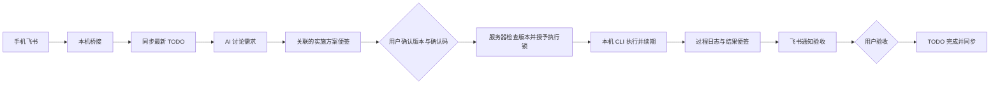

# 账号、同步与任务执行

E note 先保存本机，再同步云端。桌面无需登录；云端仅协调数据与执行状态，代码始终由选定电脑上的 Codex / Kimi CLI 执行。

## 登录和数据归属

在 **设置 → 账号** 输入服务器、账号、密码。首次创建账号需要服务器邀请码。首次登录可选择将本机便签复制到该账号；本机原数据保留。以后登录同一账号继续使用该账号的数据，不重复导入。本机模式及不同服务器/账号使用独立目录。

退出切回原来的本机便签，账号便签仍以加密形式保存在本机。没有网络也能编辑已登录账号的便签；连接恢复后补传。应用启动、每 15 秒和本机修改后约 1 秒触发同步。多台电脑安装应用，登录同一服务器的同一账号即可同步。

本次服务器：`https://47.96.175.129:8443`。桌面构建包含公开证书指纹，使用 TLS 加密并校验服务器证书、有效期和地址。无需在系统信任库中关闭证书校验。自有公共 HTTPS 证书可清空指纹，改用系统信任链。私有证书更换后应核对新证书并更新 `assets/cloud-server.json` 与客户端配置。

服务器初始化信息保存在此电脑：

```
~/Library/Application Support/ENote/server-setup.json
```

其中包含邀请码，权限 `0600`；不要提交、截图或发送给无关人员。账号密码由使用者自行设置，不与 SSH 密码共用。

## 同步机制

- 标签也是独立实体，名称、类型、说明、链接和修改时间随账号同步，TODO 用 tagIDs 引用；标签修改后所有关联任务展示最新资料，各端按修改时间排序。
- 普通便签和每条 TODO 是独立实体；TODOList 外壳、窗口大小和显示开关属于设备设置。
- 服务器分配每条实体的 revision，以及账号总 cursor。同步批次使用 `baseRevision` 比较，任意条冲突则整批拒绝，不出现半批提交。
- 桌面保留上一次服务器快照，逐字段进行三方合并：不同字段自动合并；同字段冲突、删除与修改冲突，保留本机版本并显示处理入口，可选择本机、云端或两份。
- 冲突未解决时暂停自动同步和远程执行。选择本机/云端会明确舍弃另一版本；“两份”保留云端原记录并创建本机副本。
- 物理删除同步为 tombstone，旧设备不会无声复活已删除记录。普通便签的“已删除”仍是可恢复的软删除状态。
- 同步写盘使用加密恢复日志，先落日志，再原子保存便签与快照；中断后按日志恢复。无法读取密钥、便签或同步状态时停止写入，保留原文件。
- TODO UUID 永久不变。单机编号和账号编号各自递增；离线新任务首次上传后由账号分配编号，界面编号可能调整。跨设备关联、自动化和执行流程始终用 UUID。

## 飞书远程使用

需要飞书**自建应用机器人**；自定义群机器人 webhook 只能发通知，不能承担双向讨论。

已有 cc-connect / Codex 飞书机器人时，日常查询和记录可直接安装 [E note MCP](../README.md#飞书-cc-connect--沙箱环境接入-mcp)，无需再建消息入口。特别是 shell 报 `Operation not permitted` 时，可由 MCP 连接本机 API。以下专用桥接提供自动执行锁续期、断线结果补记和人工验收；不要用同一个飞书应用同时启动多个独立消费入口。

1. 在飞书开放平台创建应用并开启机器人。按应用权限说明开通接收用户单聊消息和发送消息权限；发布到自己的组织。
2. 事件订阅选择长连接方式，订阅 `im.message.receive_v1`。无需开放电脑端口，也无需公网回调 URL。
3. 获取 App ID、App Secret 和允许操作的本人 `open_id`。当前仅处理允许用户的机器人私聊，忽略群聊和其他用户。
4. 选择一台电脑作为此机器人的入口，保持 E note 运行并登录。多台电脑可同步与执行，但同一应用机器人的长连接入口应指定一台，避免消息随机落到另一入口。
5. 本机先登录 Codex 或 Kimi CLI，确保所需模型可用。

安装独立 Python 运行环境：

```bash
python3 scripts/install_bridge.py
```

编辑 `~/Library/Application Support/ENote/bridge.json`，按 [配置示例](../bridge/config.example.json) 填写：

| 字段 | 含义 |
| --- | --- |
| `appID` / `appSecret` | 飞书应用凭据 |
| `allowedUsers` | 允许操作的飞书用户 open_id 数组 |
| `accountID` | E note 登录后 `sync-status` 返回的账号 UUID，防止切错账号执行 |
| `provider` | `codex` 或 `kimi` |
| `command` | 本机 CLI 可执行文件的绝对路径 |
| `workspaces` | 允许执行的项目绝对目录；讨论默认使用第一项 |
| `executionTimeoutSeconds` | 单次执行超时，默认 3600 秒 |

配置文件应为 `0600`。修改后启用登录自动启动：

```bash
python3 scripts/install_bridge.py --enable
```

或在终端前台运行，便于检查配置：

```bash
"$HOME/Library/Application Support/ENote/bridge-runtime/venv/bin/python3" \
  "$HOME/Library/Application Support/ENote/bridge-runtime/enote_bridge.py" \
  --config "$HOME/Library/Application Support/ENote/bridge.json"
```

手机上与机器人私聊：

```text
待办
讨论 T000001 帮我分析这个需求，先确认实现范围和验证方式
继续 流程编号 补充我的约束和验收标准
确认执行 流程编号 方案版本 确认码
状态
验收 流程编号
```

机器人会给出实际流程编号、版本和确认码，直接复制对应指令。`继续` 会重新进入讨论，旧方案需重新确认。当前没有聊天式指定执行电脑；每个桥接配置明确绑定账号、CLI 和允许工作目录。

## 从任务到验收



讨论调用 Codex 的只读 sandbox 或 Kimi 的只读讨论配置（仅 Read / Grep / Glob，不包含执行或写入工具）。执行时使用 Codex `workspace-write` 或 Kimi `--auto`，工作目录必须位于本机允许范围。审批只接受用户显式指令，AI 回复不会当作确认命令。CLI 仍受其实际版本和运行配置约束；桥接不将“提出方案”视作“允许开始”。

服务器会再次核对 TODO 版本和方案便签版本。领取后生成 executionID 和 90 秒执行锁，每 20 秒续期。相同 executionID 不会启动第二次 CLI；任何设备已有运行中的流程时，不再领取同一 TODO。锁过期不会自动转移，因为旧进程可能仍然存活。

续期失败会终止 CLI。独立计时检查不依赖网络请求返回：60 秒未取得续期确认便停止进程，预留服务器 90 秒锁的退出余量；进程不响应正常终止时，5 秒后强制结束。桥接异常退出后不自动重放已启动执行。确认原进程已经停止后，可发送：

```text
恢复 流程编号 已确认原进程停止
```

该操作只解除过期锁并转为中断状态；再次执行需要重新讨论、生成方案和确认。

完整 CLI 输出位于 `bridge/runs/<executionID>/events.jsonl`，最终结果在 `result.txt`。过程摘要和最终结果写回关联便签，同步到其他电脑。写回失败时本机 journal 保存结果并重试补记，**不会重跑任务**。本机完成状态与待发送的结果通知在同一个 SQLite 事务中提交；崩溃或写入失败不会出现已标为完成却未保存通知的间隙。若用户已人工废止旧执行锁，旧执行不能再改变流程，应先核对本机记录。

`finish` 只进入待验收；用户 `验收` 后才完成 TODO。如果验收前 TODO 又发生变化，服务器拒绝自动完成，需重新核对。

## 云端部署与维护

服务器组件使用 Python 3、SQLite WAL 和 `cryptography`。本机飞书组件使用飞书官方 `lark-oapi` SDK，桌面本体仍由 Swift 原生编译。

```bash
# 在新服务器上准备依赖，再把 server/ 中的文件复制过去
apt-get install python3 python3-cryptography openssl
cd /path/to/server
sudo bash install.sh YOUR_SERVER_IP
systemctl status enote-cloud
```

服务账号为 `enote`，程序 `/opt/enote/enote_server.py`，数据 `/var/lib/enote/`，TLS 与邀请码配置 `/etc/enote/`。公网仅暴露 HTTPS 8443；本机桌面 API 仍只监听 127.0.0.1。

密码使用 PBKDF2-HMAC-SHA256（600,000 次）加盐保存；登录令牌只存哈希并在 90 天后过期。公开注册必须提供邀请码，登录/注册有频率限制。便签正文、TODO 和流程数据在云端数据库中使用 AES-GCM 加密；主密钥在服务器独立 `master.key`。这属于传输加密及服务器静态加密，**不是端到端加密**，服务器管理员持有主密钥可解密数据。

备份应同时保留数据库一致性快照及密钥。可执行 `python3 /opt/enote/backup.py --output /private/backup/path` 使用 SQLite backup API 生成快照，连同 `/var/lib/enote/master.key`、`/etc/enote/` 加密备份；不要直接复制正在写入的单个 SQLite 主文件而遗漏 WAL。恢复前停止服务，恢复后检查文件属主和 `0600` 权限。

参考：[飞书官方 Python SDK](https://github.com/larksuite/oapi-sdk-python)、[Codex 非交互调用](https://learn.chatgpt.com/docs/non-interactive-mode)、[Kimi Code 文档](https://moonshotai.github.io/kimi-code/)。本项目运行参数同时按本机 `codex exec --help` 和 `kimi --help` 验证。


## 2026-09-15 服务升级记录

默认服务器 `47.96.175.129` 已部署项目中的 `server/enote_server.py`，支持标签实体、TODO 标签绑定和归档状态。服务为 `enote-cloud.service`，代码安装在 `/opt/enote/enote_server.py`，数据仍保存在 `/var/lib/enote`；本次没有数据库结构迁移。

升级前备份：`/var/backups/enote/upgrade-20260915-220312/`，包含旧服务代码、配置、服务单元，以及经 SQLite backup API 校验的加密数据库与密钥。备份只保存在服务器受限目录。

验证：`python3 Tests/test_cloud.py`（7 项通过）；`python3 Tests/test_deployed.py`（公网 TLS 校验、登录、两个独立客户端的标签创建/读取/修改、TODO 绑定和归档同步通过）。临时测试账号与本机测试配置已清理。
